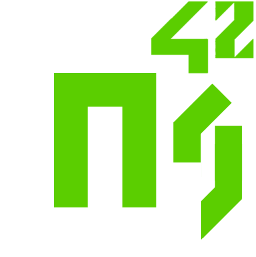

# 42MapGenerator (v2)

42MapGenerator is a tiny bash script developed at School 42 (Paris) for downloading and generating maps of the **real world**, **the Earth's moon** and the planet **Venus** for the pedagogical project **Fil de Fer (FdF)**.

It allows you to find by name the coordinates of a country or a city thanks to the **Google Geocoding API** and to reduce the exported file size by providing 5 different formats (XXL, XL, L, M, S).

It extracts topography data from 4 different providers:
* **`IGN`** (National Institute of Geographic and Forest Information / France), providing horizontal accuracy up to 250 meters of France and Overseas but excluding marine topography.

* **`NOAA`** (National Oceanic and Atmospheric Administration / USA), providing horizontal accuracy up to 1852 meters (1 arc-meter) of any region of the world but with a limited capacity of exported file size.

* **`MGDS`** (Marine Geoscience Data System / USA), providing an exceptional horizontal accuracy up to 100 meters of any region of the world, including marine topography but excluding some continental regions like Europe.

* **`USGS`** (Astrogeology Science Center / USA), providing planetary data with horizontal accuracy up to 100 meters of Earth's moon and Venus, derived from Earth-based & spatial missions photographs.


## install

```bash
git clone https://github.com/jgigault/42MapGenerator ~/42MapGenerator
```

## usage

```bash
sh ~/42MapGenerator/42MapGenerator.sh
```

At first, you're asked to select an export directory in which to save the computed FdF maps. Then select a data provider and an available region of the world or a planet. Finally, choose a format and a mode of export of the marine's topography between flatten and keep data.

## options

```
--no-update   // Do not check for updates at launch
--no-color    // Do not display color tags
--no-timeout  // Disable time-out for child processes
```

Add your options as arguments at launch:

```bash
sh ./42MapGenerator --no-update --no-timeout
```

## preset maps


##### IGN

* France Métropolitaine
* DOM-TOM: Guadeloupe
* DOM-TOM: Martinique
* DOM-TOM: Réunion
* DOM-TOM: Guyane
* DOM-TOM: Saint Martin - Saint Barthélémy

##### USGS

* Earth's moon
* Venus

##### NOAA / MGDS

* Whole world *(MGDS only)*
* Antarctic *(MGDS only)*
* Arctic *(MGDS only)*
* Europe *(NOAA only)*
* Alaska-Aleutians *(MGDS only)*
* Cascade Range (West Coast USA)
* Central America
* East African Rift System
* Eastern North American Margin
* Gulf of California
* Amazonia
* Cordillera de los Andes
* Izu-Bonin-Marinia
* Nankai
* New Zealand
* Papua New Guinea
* Red Sea
* Himalaya
* Mid-Ocean Ridges: EPR 8-11 N
* Mid-Ocean Ridges: JdF Endeavour
* Mid-Ocean Ridges: Lau Basin

## custom maps

Using **NOAA** or **MGDS** as data provider allows you to find by name a country or a city (*MGDS only*). The coordinates are requested through the **Google Geocoding API**.

Before downloading and generating a custom map, you can request for an online preview image through the **MGDS portal** which is opened in your default browser.


## previews


## about FdF format

The pedagogical project **Fil de Fer (FdF)** consists in creating a C program that displays a graphical representation of a land. The program takes as first argument a path to a file which contains topography data.

A map for the project FdF is a simple text file based on the standard  [*ARC/INFO Grid Format*](https://en.wikipedia.org/wiki/Esri_grid) whose headers are removed.

Here is an ARC/INFO Grid sample file (header are the first 6 lines):

```text
ncols         4
nrows         6
xllcorner     0.0
yllcorner     0.0
cellsize      50.0
NODATA_value  -9999
-9999 -9999 5 2
-9999 20 100 36
3 8 35 10
32 42 50 6
88 75 27 9
13 5 1 -9999
```

This type of topography data is available through GIS Web Services and several open data FTP servers.

## credits

* **`MNT BD Alti®`** IGN National Institute of Geographic and Forest Information / France (http://professionnels.ign.fr/bdalti)

* **`NGDC Grid Extraction Tool`** NOAA National Oceanic and Atmospheric Administration / USA (http://maps.ngdc.noaa.gov/viewers/wcs-client)

* **`GMRT Map Tool`** MGDS Marine Geoscience Data System / USA. Ryan, W.B.F., S.M. Carbotte, J.O. Coplan, S. O'Hara, A. Melkonian, R. Arko, R.A. Weissel, V. Ferrini, A. Goodwillie, F. Nitsche, J. Bonczkowski, and R. Zemsky (2009), Global Multi-Resolution Topography synthesis, Geochem. Geophys. Geosyst., 10, Q03014, doi: 10.1029/2008GC002332 (http://www.marine-geo.org/tools/GMRTMapTool/)

* **`USGS Planetary GIS Web Server`** USGS Astrogeology Science Center / USA (http://webgis.wr.usgs.gov/pigwad/down/index.html)

* **`Google Geocoding API`** (https://developers.google.com/maps/documentation/geocoding/)
